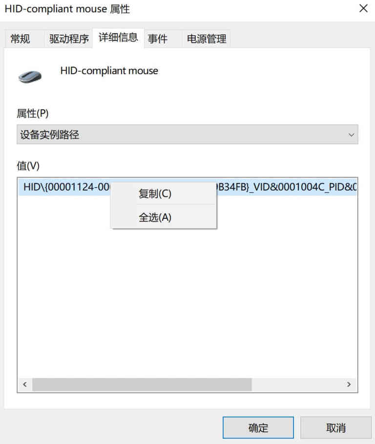

## Windows中打造mac风格

1. 安装mactype解决字体渲染效果，使用service方式启动，更稳定。

   https://www.mactype.net/

2. 安装苹方字体，复制到windows/fonts下

   https://github.com/ShmilyHTT/PingFang

3. 使用NoMeiryoUI应用苹方字体

   https://github.com/Tatsu-syo/noMeiryoUI

4. 交换ctrl和alt按键

   [keyboard.reg](keyboard.reg)

5. 处理alt+tab切换窗口，使用AutoHotKey软件

6. 处理鼠标滚轮

   查看鼠标DeviceId

   

   修改注册表`计算机\HKEY_LOCAL_MACHINE\SYSTEM\CurrentControlSet\Enum\{设备实例地址}\Device Parameters`

   修改`FlipFlopHScroll `值改为`1`

7. 隐藏左下角应用图标，搜索栏
8. 使用uTools代替mac spotlight `https://www.u.tools/`
9. 安装QuickLook代替mac快速查看功能 `https://github.com/QL-Win/QuickLook`
10. chrome浏览器安装油猴脚本使用下面脚本强制使用苹方字体

https://greasyfork.org/zh-CN/scripts/453435-%E5%85%A8%E5%B1%80%E8%8B%B9%E6%96%B9
